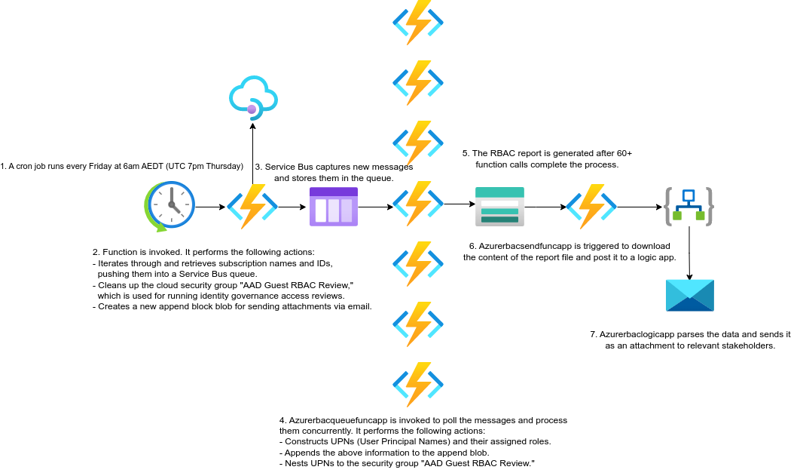
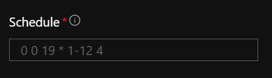
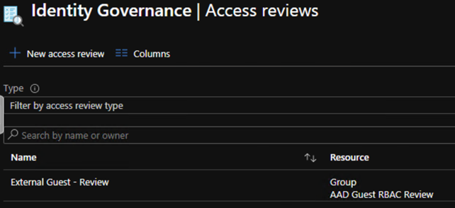
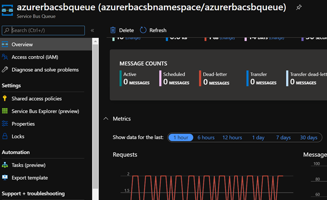
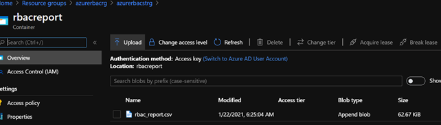
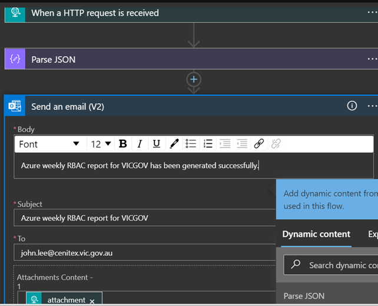

# VICGOV - Azure RBAC Report Workflow

## Table of Contents
1. [Introduction](#1-introduction)
   1. [Overview](#11-overview)
2. [Logical Architecture](#2-logical-architecture)
   1. [Logical System Component Overview](#21-logical-system-component-overview)

## 1. Introduction
### 1.1 Overview

The VICGOV - Azure RBAC Report Workflow aims to simplify the management of external guest accounts' RBAC across a significant number of subscriptions. This document provides a high-level overview of the workflow for capturing and generating the RBAC report for #EXT# accounts. It also includes a detailed troubleshooting guide.

## 2. Logical Architecture
### 2.1 Logical System Component Overview

The logical architecture of the VICGOV - Azure RBAC Report Workflow is as follows:

1. A cron job runs every Friday at 6am AEDT (UTC 7pm Thursday).
   - 

2. Azurerbacfuncapp @GSPINFRA03 is invoked. It performs the following actions:
   - Iterates through and retrieves subscription names and IDs, pushing them into a Service Bus queue.
   - Cleans up the cloud security group "AAD Guest RBAC Review," which is used for running identity governance access reviews.
   - Creates a new append block blob for sending attachments via email.
   - 

3. Service Bus captures new messages and stores them in the queue.
   - 

4. Azurerbacqueuefuncapp is invoked to poll the messages and process them concurrently. It performs the following actions:
   - Constructs UPNs (User Principal Names) and their assigned roles.
   - Appends the above information to the append blob.
   - Nests UPNs to the security group "AAD Guest RBAC Review."
   - 

5. The RBAC report is generated after 60+ function calls complete the process.
   - 

6. Azurerbacsendfuncapp is triggered to download the content of the report file and post it to a logic app.

7. Azurerbaclogicapp parses the data and sends it as an attachment to relevant stakeholders.
   - 
